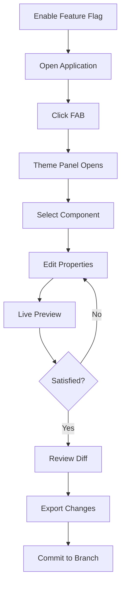

# ThemeTweaker — Product Requirements Document

## 1. Product Overview

ThemeTweaker is a dev-only visual theming tool that enables live editing of CSS tokens, component styles, and variants through an intuitive browser-based UI. It integrates seamlessly with Next.js + Tailwind v4 + shadcn/ui projects, allowing developers to preview changes instantly without re-renders and export modifications back to the codebase.

The tool solves the problem of tedious manual CSS editing by providing a visual interface for theme customization, targeting developers who need to rapidly prototype and iterate on design systems while maintaining code quality and consistency.

## 2. Core Features

### 2.1 User Roles

| Role      | Registration Method                                    | Core Permissions                                               |
| --------- | ------------------------------------------------------ | -------------------------------------------------------------- |
| Developer | Feature flag activation (NEXT\_PUBLIC\_THEMETWEAKER=1) | Full access to all theming controls, save/export functionality |

### 2.2 Feature Module

Our ThemeTweaker requirements consist of the following main components:

1. **Floating Action Button (FAB)**: toggle tool visibility, fixed positioning
2. **Theme Panel**: tabbed interface with Tokens, Components, Layout, and Diff sections
3. **Component Inspector**: selected component details, theme toggle, impact analysis
4. **Visual Controls**: color pickers, sliders, toggles for styling properties
5. **Click-to-Edit Mode**: component selection via data-ui attributes
6. **Live Preview**: real-time CSS injection without page re-render
7. **Repository Scanner**: automatic discovery of token files and component structures
8. **Diff System**: change review and export functionality

### 2.3 Page Details

| Page Name          | Module Name            | Feature description                                                              |
| ------------------ | ---------------------- | -------------------------------------------------------------------------------- |
| Main Application   | Floating Action Button | Toggle tool panel visibility, fixed bottom-right positioning with high z-index   |
| Main Application   | Selection Overlay      | Highlight selected components, capture click events on data-ui elements          |
| Theme Panel        | Token Editor           | Edit global CSS variables for light/dark themes, color pickers for brand palette |
| Theme Panel        | Component Controls     | Modify colors, spacing, borders, shadows, typography per component type          |
| Theme Panel        | Variant Selector       | Choose and edit component variants (default, outline, ghost, etc.)               |
| Theme Panel        | Layout Controls        | Background colors/images, layout spacing, responsive settings                    |
| Theme Panel        | Scope Selector         | Choose application scope: Global token, Class override, Instance only            |
| Theme Panel        | Impact Panel           | Display affected components when editing tokens                                  |
| Theme Panel        | Diff Viewer            | Review pending changes, file patches, commit preview                             |
| Repository Scanner | File Discovery         | Scan project for token files, component wrappers, style imports                  |
| Repository Scanner | Cache Management       | Build and maintain theme-map.json with component-token relationships             |

## 3. Core Process

**Developer Workflow:**

1. Enable feature flag (NEXT\_PUBLIC\_THEMETWEAKER=1)
2. Access application with ThemeTweaker FAB visible
3. Click FAB to open theme panel
4. Select component via click-to-edit or component picker
5. Modify styling properties using visual controls
6. Preview changes in real-time
7. Review changes in Diff tab
8. Export changes to codebase files
9. Commit changes on new branch with revert option

## 4. User Interface Design

### 4.1 Design Style

* **Primary Colors**: Inherit from existing theme system (--primary, --secondary)

* **Secondary Colors**: Muted backgrounds (--muted, --card) for panel areas

* **Button Style**: Rounded corners using --radius token, subtle shadows

* **Font**: Geist Sans for UI text, consistent with main application

* **Layout Style**: Card-based panels, tabbed navigation, floating overlay design

* **Icon Style**: Lucide React icons for consistency with existing UI

### 4.2 Page Design Overview

| Page Name         | Module Name            | UI Elements                                                                                   |
| ----------------- | ---------------------- | --------------------------------------------------------------------------------------------- |
| Main Application  | Floating Action Button | Circular button, bottom-right fixed, primary color, paint brush icon, smooth hover animations |
| Theme Panel       | Panel Container        | Right-side overlay, card background, shadow elevation, 400px width, full height               |
| Theme Panel       | Tab Navigation         | Horizontal tabs (Tokens, Components, Layout, Diff), active state indicators                   |
| Theme Panel       | Color Controls         | Color picker inputs, hex/oklch value displays, swatch previews                                |
| Theme Panel       | Numeric Controls       | Sliders with value inputs, step controls, unit selectors (px, rem, %)                         |
| Theme Panel       | Toggle Controls        | Switch components for boolean properties, clear on/off states                                 |
| Theme Panel       | Scope Selector         | Radio button group, clear visual hierarchy, impact indicators                                 |
| Selection Overlay | Highlight Box          | Dashed border outline, primary color, component name label                                    |

### 4.3 Responsiveness

Desktop-first design with mobile-adaptive considerations:

* Panel collapses to drawer on mobile screens

* Touch-optimized controls for mobile devices

* Responsive FAB positioning and sizing

* Simplified mobile interface with essential controls only

