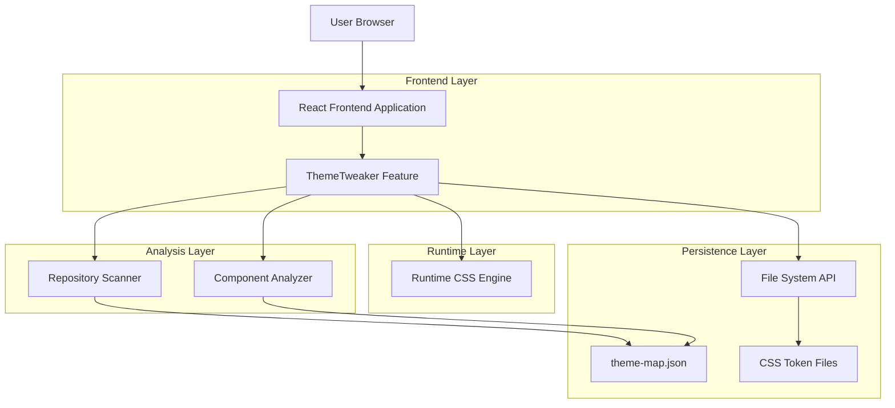
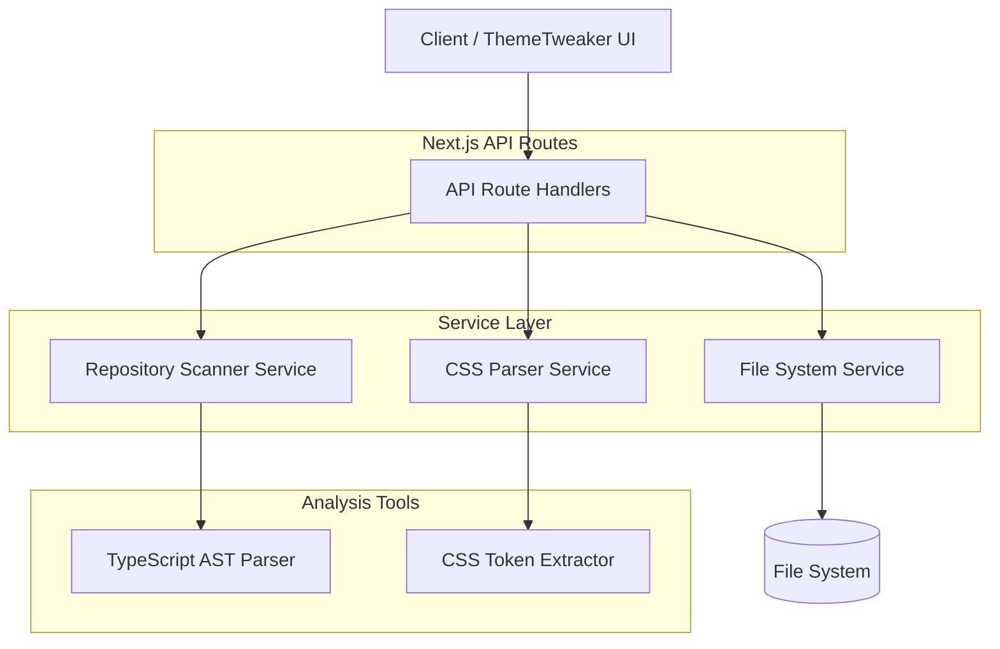
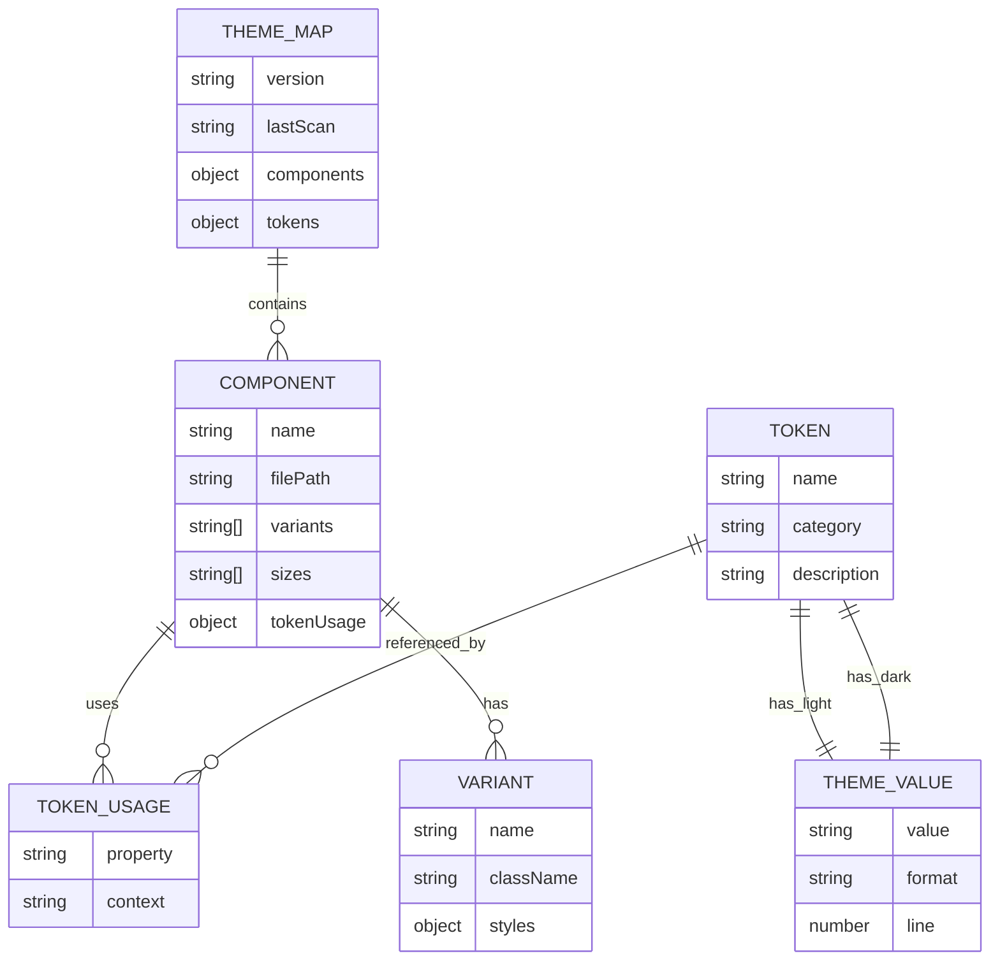

# ThemeTweaker — Technical Architecture Document

## 1. Architecture Design



## 2. Technology Description

* Frontend: React\@19 + Next.js\@15 + TypeScript\@5 + Tailwind CSS\@4

* State Management: Zustand\@5 for tool state

* UI Components: Existing shadcn/ui components + Radix primitives

* CSS Runtime: Dynamic style injection via DOM manipulation

* File Analysis: TypeScript AST parsing with ts-morph

* Theme Management: next-themes\@0.4 integration

## 3. Route Definitions

| Route                   | Purpose                                                  |
| ----------------------- | -------------------------------------------------------- |
| /\* (all routes)        | ThemeTweaker overlay available when feature flag enabled |
| /api/theme-tweaker/scan | Repository scanning endpoint for file discovery          |
| /api/theme-tweaker/save | Save changes to file system                              |
| /api/theme-tweaker/diff | Generate diff preview for changes                        |

## 4. API Definitions

### 4.1 Core API

Repository scanning

```
POST /api/theme-tweaker/scan
```

Request:

| Param Name   | Param Type | isRequired | Description                                           |
| ------------ | ---------- | ---------- | ----------------------------------------------------- |
| targetPath   | string     | false      | Specific directory to scan (defaults to project root) |
| forceRefresh | boolean    | false      | Force cache refresh                                   |

Response:

| Param Name     | Param Type | Description                                   |
| -------------- | ---------- | --------------------------------------------- |
| tokenFiles     | string\[]  | Discovered CSS files with token definitions   |
| componentFiles | string\[]  | React component files with data-ui attributes |
| themeMap       | object     | Cached component-token relationships          |

Example:

```json
{
  "tokenFiles": ["/src/app/globals.css"],
  "componentFiles": ["/src/components/ui/button.tsx"],
  "themeMap": {
    "Button": {
      "tokens": ["--primary", "--radius"],
      "variants": ["default", "outline", "ghost"]
    }
  }
}
```

Save changes

```
POST /api/theme-tweaker/save
```

Request:

| Param Name   | Param Type | isRequired | Description                                      |
| ------------ | ---------- | ---------- | ------------------------------------------------ |
| changes      | object     | true       | Token updates, class overrides, instance changes |
| targetFiles  | string\[]  | true       | Files to modify                                  |
| createBranch | boolean    | false      | Create new git branch for changes                |

Response:

| Param Name    | Param Type | Description                         |
| ------------- | ---------- | ----------------------------------- |
| success       | boolean    | Operation success status            |
| branchName    | string     | Created branch name (if applicable) |
| modifiedFiles | string\[]  | List of modified files              |

## 5. Server Architecture Diagram



## 6. Data Model

### 6.1 Data Model Definition



### 6.2 Data Definition Language

Theme Map Cache (theme-map.json)

```typescript
interface ThemeMap {
  version: string;
  lastScan: string;
  tokenFiles: string[];
  components: Record<string, ComponentInfo>;
  tokens: Record<string, TokenInfo>;
}

interface ComponentInfo {
  name: string;
  filePath: string;
  variants: string[];
  sizes?: string[];
  tokenUsage: Record<string, string[]>; // property -> token names
  dataAttributes: {
    ui: string;
    variant?: string;
    size?: string;
  };
}

interface TokenInfo {
  name: string;
  category: 'color' | 'spacing' | 'typography' | 'shadow' | 'border';
  lightValue: string;
  darkValue: string;
  lightLine: number;
  darkLine: number;
  usedBy: string[]; // component names
}
```

Runtime State (Zustand Store)

```typescript
interface ThemeTweakerState {
  // UI State
  isOpen: boolean;
  activeTab: 'tokens' | 'components' | 'layout' | 'diff';
  selectedComponent: string | null;
  selectionMode: boolean;
  
  // Theme State
  currentTheme: 'light' | 'dark';
  previewTheme: 'light' | 'dark';
  
  // Edit State
  pendingChanges: Record<string, any>;
  undoStack: any[];
  redoStack: any[];
  
  // Data
  themeMap: ThemeMap | null;
  runtimeStyles: string;
  
  // Actions
  togglePanel: () => void;
  setActiveTab: (tab: string) => void;
  selectComponent: (component: string) => void;
  updateToken: (token: string, value: string, theme: 'light' | 'dark') => void;
  applyRuntimeStyle: (css: string) => void;
  saveChanges: () => Promise<void>;
  undo: () => void;
  redo: () => void;
}
```

Component Data Attributes

```typescript
// Added to existing UI components when NEXT_PUBLIC_THEMETWEAKER=1
interface ComponentDataAttributes {
  'data-ui': string; // Component name (e.g., 'Button', 'Card')
  'data-variant'?: string; // Current variant (e.g., 'default', 'outline')
  'data-size'?: string; // Current size (e.g., 'sm', 'lg')
  'data-theme-scope'?: 'global' | 'class' | 'instance'; // Edit scope
}
```

CSS Token Structure

```css
/* Global tokens in globals.css */
:root {
  /* Brand palette (6-slot system) */
  --brand-1: oklch(65% 0.15 25);
  --brand-2: oklch(70% 0.12 120);
  --brand-3: oklch(68% 0.14 260);
  --brand-4: oklch(72% 0.10 40);
  --brand-5: oklch(60% 0.16 330);
  --brand-6: oklch(55% 0.12 200);
  
  /* Semantic mappings */
  --primary: var(--brand-1);
  --secondary: var(--brand-2);
  --accent: var(--brand-3);
  
  /* Existing shadcn tokens */
  --background: oklch(1 0 0);
  --foreground: oklch(0.145 0 0);
  /* ... other tokens ... */
}

.dark {
  /* Dark theme overrides */
  --brand-1: oklch(78% 0.10 25);
  --brand-2: oklch(80% 0.09 120);
  /* ... other dark values ... */
}
```

